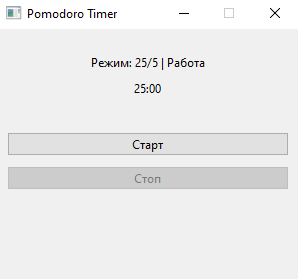

# Pomodoro Timer

Приложение для управления временем по технике Pomodoro с тремя режимами работы.

##  Установка

1. Клонируйте репозиторий:
```bash
git clone https://github.com/5abre/pomodoro_timer
cd project_pomodoro
```

2. Установите зависимости:
```bash
pip install PyQt6
```

##  Запуск
```bash
python src/main.py
```

##  Интерфейс


##  Функционал
- Три режима работы:
  -  Классический: 25/5 минут
  -  Стандартный: 30/10 минут
  -  Продвинутый: 45/15 минут
- Автоматическое переключение между фазами
- Обратный отсчет времени
- Визуальное отображение текущего режима
